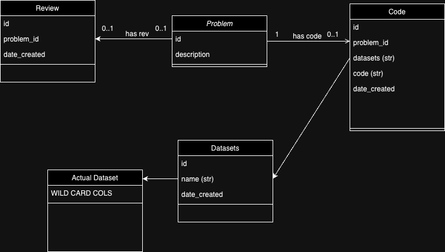
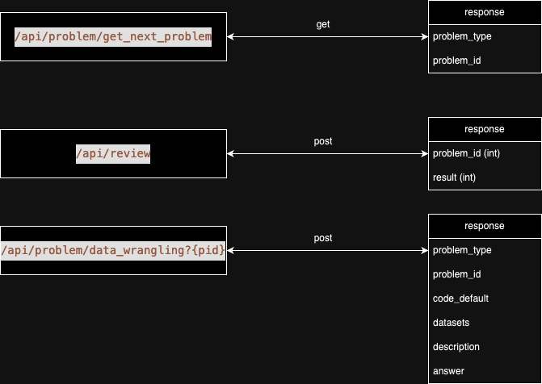

# Memory

This is a implementation of memory app. I've switched to using fastapi.

poetry run pytest tests/test_crud.py

## Table of Contents

- [Memory](#memory)
- [Docker](#docker)
- [Db structure](#db-structure)
- [UI](#ui)
- [Setting up DevContainer](#setting-up-devcontainer)
- [Running the Basic Server](#running-the-basic-server)
- [Production Build](#production-build)

## Docker

- docker-compose up -d
- azure sql edge for running Tsql queries
- postgres for main data storage
- spark can be moved into a container
- Get docker exec -it postgres_db bash
- psql -h ferg234e1341 -U postgres
- apt install postgresql-client

- docker compose up
- psql -h 127.0.0.1 -U ferg234e1341 -d memory_db

psycopg2 = adaptor for postgres on python

## Db structure



## UI



- These are 'core' methods. There are a few more.
- I've refactored the backend to not have explicit 'polars problems'. However frontend still works from old format. I use new data model to construct old response.

## Setting up DevContainer

This project supports development using Visual Studio Code's DevContainers. DevContainers provide a consistent, isolated development environment that can be easily shared across team members. Follow these steps to set up and use the DevContainer:

1. Prerequisites:

   - Install [Visual Studio Code](https://code.visualstudio.com/)
   - Install [Docker Desktop](https://www.docker.com/products/docker-desktop)
   - Install the [Remote - Containers](https://marketplace.visualstudio.com/items?itemName=ms-vscode-remote.remote-containers) extension in VS Code

2. Clone the repository:

   ```
   git clone https://github.com/your-repo/memory-slim.git
   cd memory-slim
   ```

3. Open the project in VS Code:

   ```
   code .
   ```

4. When prompted, click "Reopen in Container" or use the command palette (F1) and select "Remote-Containers: Reopen in Container".

5. VS Code will build the DevContainer (this may take a few minutes the first time) and open the project inside the container.

6. Once inside the container, you'll have access to all the necessary tools and dependencies to develop and run the project.

7. You can now run the backend and frontend as described in the "Running the Basic Server" section, but from within the DevContainer environment.

The DevContainer configuration is defined in the `.devcontainer/devcontainer.json` file. This setup ensures that all developers are working with the same environment, reducing "it works on my machine" issues and simplifying onboarding for new team members.

## Running the Basic Server

To run the basic server for development purposes, follow these steps:

1. Set up poetry environment

   ```
   poetry shell
   ```

2. Start the FastAPI server:

   ```
   uvicorn backend.app:app --host 0.0.0.0 --port 8000 --reload
   ```

3. Set up the frontend:

   ```
   cd frontend
   npm install
   ```

4. Start the frontend development server:

   ```
   npm run dev
   ```

5. Access the application:
   Open your web browser and navigate to `http://localhost:3000` (or the port specified by your frontend dev server).

The backend API will be available at `http://localhost:8000`, and the frontend development server will proxy API requests to this address.

## Production Build

To create a production build of the Memory Slim application, follow these steps:

1. Build the frontend:

   ```
   cd frontend
   npm install
   npm run build
   ```

   This will create a production-ready build of the React app in the `static/frontend` directory.

2. Install Python dependencies:

   ```
   pip install poetry
   poetry install
   ```

3. Export Python dependencies to requirements.txt:

   ```
   poetry export -f requirements.txt --output requirements.txt --without-hashes
   ```

4. Build the Docker image:

   ```
   sudo docker build -f Dockerfile -t memory-prd .
   ```

5. Run the Docker container:
   ```
   sudo docker run -d -p 9898:9898 -v ~/docker_data/memory_slim_db:/app/db memory-prd
   sudo docker run -p 9898:9898 -v ~/docker_data/memory_slim_db:/app/db memory-prd
   ```
   -d is to run in detached mode.
   -p is to map port 9898 to port 9898 on the host machine.
   -v is to map the db directory to the host machine.

The application will now be accessible at `http://localhost:9898`.

Note: Make sure you have Docker installed on your system before running the Docker commands.

For convenience, steps 3-4 are combined in the `scripts/build.sh` script. You can run it with:
